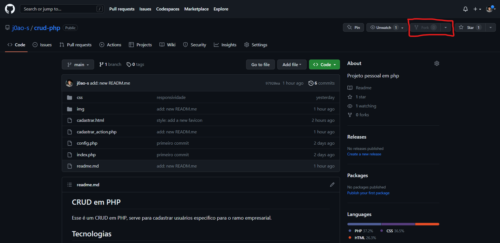
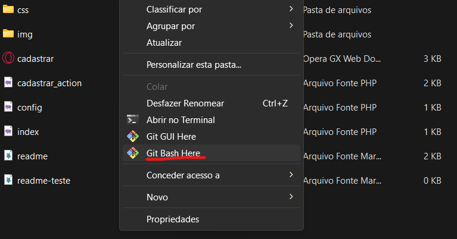
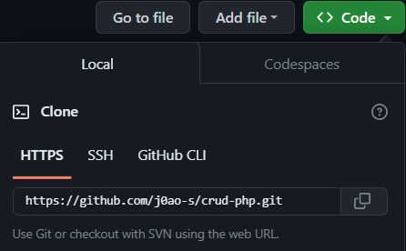
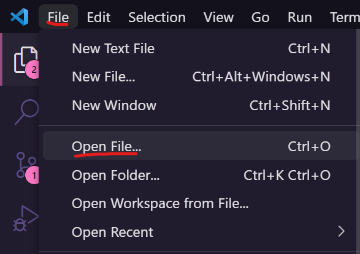
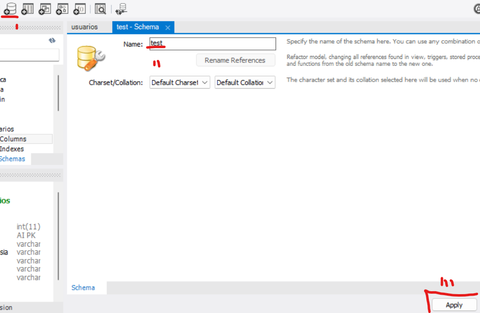

## CRUD em PHP
Esse é um CRUD em PHP, serve para cadastrar usuários
especifico para o ramo empresarial. 

## Tecnologias 

Estas são as tecnologias utilizadas neste projeto!

* HTML5
* CSS3
* MySQL Workbench 8.0.33
* PHP 8.2.4

## Serviços usados

* Github

## Como começar?

* O tutorial de uso vai levar em consideração que estejam usando o XAMPP para servidor local, o WorkBench MySQL como banco de dados, O Visual Studio Code como editor de texto e o Git como sistema de controle.
    - link XAMPP: https://www.apachefriends.org/pt_br/index.html
    - link WorkBench: https://dev.mysql.com/downloads/workbench/
    - Visual Studio COde: https://code.visualstudio.com/download
    - Git: https://git-scm.com/download/win

* Crie uma pasta no diretório htdocs (esta pasta foi criada junto com os arquivos XAMPP) sugiro colocar o nome de _php-crud_

* Faça um Fork do meu repositório para a sua conta GitHub.

* Abra o terminal Git Bash

* Utilize no terminal o comando git clone -link- o _link_ você encontrará no botãos _Code_ do github 

* Abra a pasta _php-crud_ do Visual Studio Code

* Agora crie e contrua um Banco de Dados chamado _test_.

* Depois crie uma tabela chamada _usuarios_.

* Logo após isso crie seis colunas com os nomes de _id_, _razaoSocial_, _nomeFantasia_, _cnpj_, _endereço_ e _telefone_. Não esqueça de configurar as colunas com seus respectivos atributos.
  

* Agora é só rodar/testar o projeto!

## Como usar? 

### 1 - Quando você acessar vai se deparar com uma tela de cadastro.

* Depois de preencher o formulário os dados devem ir para o banco de dados criados! algumas funcionalidade interessantes são que o banco de dados não aceita o cadastro de dois cnpj iguais 

## Caracteristicas

A caracteristica principais do projeto é o cadastro de usuários.

## Links
  - Repositorio : https://github.com/j0ao-s/crud-php
    - Em caso de bugs, vulnerabilidades na segurança do projeto por favor entrar em contato por joaaomanoeljok@gmail.com

  ## Versioning

  1.0.0.0

  ## Authors

  * **João Manoel da Silva Oliveira** 